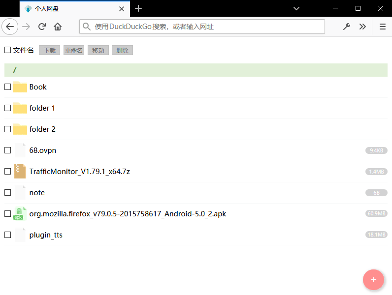

# Intro

Simple web drive based on [WebDrive by DrBrad](https://github.com/DrBrad/WebDrive). I work on it to learn php and css.

Features:

1. light-weight & easy-to-use;
2. basic file and folder operations;
3. online editing.



**Important:**

* Make sure Apache has read/write access to `root/`, which is the root directory of storage.
```sh
chown www-data:www-data path/to/root
chmod g+rw path/to/root
```

* By default PHP limits upload file size to 2MB. Modify `php.ini` like the following (may find this file using `locate`).
```
...
max_input_time = -1
...
post_max_size = 150M
...
upload_max_filesize = 128M
...
```
Here I set the upper bound to 128M. `post_max_size` should be larger than `upload_max_filesize`.

* Due to implementation details, online editing is possible only on linux servers.

[Project](https://gitee.com/maoruimas/webdrive)

# Todo

support for multiple browsers
